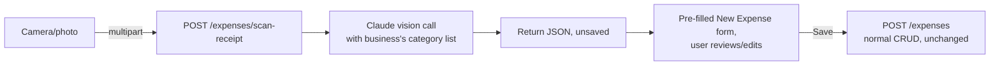

# Design: Expense Management, Vendors, and AI Receipt Scanner

## Problem

InvoiceAI currently only tracks money coming in (invoices, payments). There is no way to record money going out — no expenses, no vendors/suppliers, no categorization. This is the first module of the broader "Business OS" expansion plan and is a prerequisite for Financial Reports and GST/HST Reporting, both of which need expense data to compute net income and input tax credits.

## Scope

- New `Vendor`, `ExpenseCategory`, and `Expense` tables and CRUD routers, following the existing `Customer`/`CatalogItem` CRUD pattern exactly (`backend/app/routers/customers.py` is the template: `get_business` dependency, `to_dict()`, archive-on-delete, `q` search param).
- Every new business gets a pre-seeded, editable list of ~14 CRA-aligned expense categories at creation time.
- A synchronous AI receipt scanner: photograph or upload a receipt, get suggested field values back in the same request, review/edit in the normal expense form, save normally. No image storage, no background job, no polling — this app has no file/object storage infrastructure yet, and building one is out of scope for this module.
- Explicitly deferred (not in this spec): billable-to-customer expenses, job/project linkage, bill payable (money owed to vendors on terms), inventory linkage. These wait for Job Management (Phase 2) and Bills Payable, which give them something meaningful to attach to.

## Data model

New Alembic migration adding three tables, following the existing model conventions in `backend/app/models.py` (`PG_UUID` string PK via `new_id()`, `business_id` FK with `ondelete="CASCADE"` + index, `_cents` integer money columns, `created_at`/`updated_at` timestamps):

```python
class Vendor(Base):
    __tablename__ = "vendors"
    id: Mapped[str] = mapped_column(PG_UUID(as_uuid=False), primary_key=True, default=new_id)
    business_id: Mapped[str] = mapped_column(PG_UUID(as_uuid=False), ForeignKey("businesses.id", ondelete="CASCADE"), index=True)
    name: Mapped[str] = mapped_column(String)
    email: Mapped[Optional[str]] = mapped_column(String, nullable=True)
    phone: Mapped[Optional[str]] = mapped_column(String, nullable=True)
    address_line1: Mapped[Optional[str]] = mapped_column(String, nullable=True)
    city: Mapped[Optional[str]] = mapped_column(String, nullable=True)
    region: Mapped[Optional[str]] = mapped_column(String, nullable=True)
    postal_code: Mapped[Optional[str]] = mapped_column(String, nullable=True)
    country: Mapped[Optional[str]] = mapped_column(String, nullable=True)
    notes: Mapped[Optional[str]] = mapped_column(Text, nullable=True)
    archived: Mapped[bool] = mapped_column(Boolean, default=False)
    created_at: Mapped[datetime] = mapped_column(DateTime(timezone=True), server_default=func.now())
    updated_at: Mapped[Optional[datetime]] = mapped_column(DateTime(timezone=True), nullable=True, onupdate=func.now())


class ExpenseCategory(Base):
    __tablename__ = "expense_categories"
    id: Mapped[str] = mapped_column(PG_UUID(as_uuid=False), primary_key=True, default=new_id)
    business_id: Mapped[str] = mapped_column(PG_UUID(as_uuid=False), ForeignKey("businesses.id", ondelete="CASCADE"), index=True)
    name: Mapped[str] = mapped_column(String)
    cra_t2125_line: Mapped[Optional[str]] = mapped_column(String, nullable=True)
    is_default: Mapped[bool] = mapped_column(Boolean, default=False)
    archived: Mapped[bool] = mapped_column(Boolean, default=False)


class Expense(Base):
    __tablename__ = "expenses"
    id: Mapped[str] = mapped_column(PG_UUID(as_uuid=False), primary_key=True, default=new_id)
    business_id: Mapped[str] = mapped_column(PG_UUID(as_uuid=False), ForeignKey("businesses.id", ondelete="CASCADE"), index=True)
    vendor_id: Mapped[Optional[str]] = mapped_column(PG_UUID(as_uuid=False), ForeignKey("vendors.id"), nullable=True, index=True)
    category_id: Mapped[str] = mapped_column(PG_UUID(as_uuid=False), ForeignKey("expense_categories.id"), index=True)
    date: Mapped[str] = mapped_column(Date)
    amount_cents: Mapped[int] = mapped_column(Integer)
    tax_cents: Mapped[int] = mapped_column(Integer, default=0)
    currency: Mapped[str] = mapped_column(String, default="USD")
    payment_method: Mapped[Optional[str]] = mapped_column(String, nullable=True)
    description: Mapped[Optional[str]] = mapped_column(Text, nullable=True)
    created_at: Mapped[datetime] = mapped_column(DateTime(timezone=True), server_default=func.now())
    updated_at: Mapped[Optional[datetime]] = mapped_column(DateTime(timezone=True), nullable=True, onupdate=func.now())
```

`vendor_id` is nullable: most receipts (fuel, parking, a one-off supply run) don't warrant a formal vendor record. `category_id` is required — every expense must be classified, since that's what makes Financial Reports and GST/HST Reporting possible later.

Default category seed list (created for every business on signup, same trigger point as the business row itself — `backend/app/routers/auth.py`'s registration flow, and the Clerk-exchange equivalent): Advertising & Marketing, Bank Charges & Interest, Insurance, Meals & Entertainment, Motor Vehicle Expenses, Office Supplies, Professional Fees, Rent, Repairs & Maintenance, Salaries & Wages, Supplies, Travel, Utilities, Other Expenses — each with a matching `cra_t2125_line` label. Businesses can rename, archive, or add to this list; `is_default=True` only marks provenance, it does not restrict editing.

## Backend

Three new routers under `backend/app/routers/`, registered in `backend/app/main.py` alongside the existing ones:

- **`vendors.py`** — `GET/POST /vendors`, `GET/PATCH/DELETE /vendors/{id}`. Identical shape to `customers.py`: list supports `q` search over name/email, delete sets `archived=True` rather than deleting the row.
- **`expense_categories.py`** — `GET/POST /expense-categories`, `PATCH/DELETE /expense-categories/{id}`. Delete checks for any non-archived `Expense` referencing the category first and returns `409` if found (a category in use shouldn't silently vanish from past records — same reasoning as why invoices don't get hard-deleted).
- **`expenses.py`** — `GET/POST /expenses`, `GET/PATCH/DELETE /expenses/{id}`. List supports `q` (description), `category_id`, `vendor_id`, and `from`/`to` date-range filters, mirroring the date-range pattern already used in `invoices.py`'s CSV export. Delete is a hard delete (unlike customers/vendors/categories) — an expense has no other record type referencing it, so there's nothing left dangling.

New Pydantic schemas in `backend/app/schemas.py`: `VendorIn`, `ExpenseCategoryIn`, `ExpenseIn` — same shape convention as `CustomerIn`/`CatalogItemIn` (plain fields, no computed values).

**Receipt scanner** — one additional endpoint, `POST /expenses/scan-receipt` in `expenses.py`:

- Accepts `multipart/form-data` with a single image file.
- Loads the business's `anthropic_api_key` (same field already used by the existing AI invoice-creation flow in `ai.py` — reuse that lookup/client-construction helper rather than duplicating it).
- Sends the image to Claude with a vision-capable model and a prompt that includes the business's actual `expense_categories` (id + name) so the model can return a real `category_id`, not free text that has to be matched afterward.
- Returns, without persisting anything: `{vendor_name, date, amount_cents, tax_cents, category_id, description}`. Any field the model can't confidently extract comes back `null`.
- No new table, no image persisted anywhere — the uploaded file exists only in request memory for the duration of the call.



## Frontend

Two new screens under `frontend/app/(app)/`, structured and styled like the existing `customers.tsx`/`catalog.tsx` (list + search + New button opening a form modal/screen):

- **`vendors.tsx`** — list/search/create/edit/archive, same shape as `customers.tsx`.
- **`expenses.tsx`** — list/search/filter (category, vendor, date range) /create/edit/delete. The "New Expense" entry point is two-pronged: a manual "+ Add expense" action opens a blank form, and a camera icon opens the device camera via `expo-image-picker` (`mediaTypes: "images"`), uploads the photo to `/expenses/scan-receipt`, and opens the *same* form pre-filled with the response — one form, two ways to start it, so there's no separate "confirm scan" screen to maintain.
- Vendor field on the expense form is a type-to-search-or-create combobox against `/vendors`, matching the existing customer-picker pattern on the invoice form.
- `frontend/src/lib/types.ts`: add `Vendor`, `ExpenseCategory`, `Expense` types.
- Add "Expenses" and "Vendors" entries to the app's tab/nav alongside Dashboard/Invoices/Customers/Catalog/Settings.

## Error handling

- Vision call failure (timeout, malformed response, no `anthropic_api_key` configured for the business) returns a normal error response; the frontend catches it and opens the New Expense form empty with a toast ("Couldn't read that receipt — enter it manually"), never a dead end.
- Partial extraction (some fields `null`) is not an error — the form simply shows those fields blank for manual entry.
- Expense category delete blocked with `409` while in use, surfaced as an inline error, matching how the frontend already handles blocked-delete cases elsewhere.

## Testing

Backend: `pytest` coverage mirroring `test_customers.py`'s existing pattern — CRUD round-trip, business-scoping isolation (business A can't see/edit business B's vendors/expenses), category delete-while-in-use returns 409. The scan endpoint gets a test with a mocked Anthropic client response covering full extraction, partial (`null` fields) extraction, and a simulated API failure, asserting the endpoint degrades to a partial/empty result rather than 500ing.

Frontend/manual: verify against the real backend, following this project's established practice of testing live features in the browser rather than relying on type-checking alone — register a fresh business, confirm the 14 default categories appear, create a vendor, log an expense both manually and via a photographed receipt, edit and archive a vendor, confirm archived vendors/categories drop out of the picker lists but stay attached to their historical expenses.
